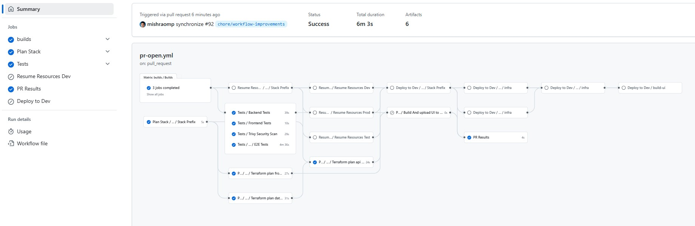
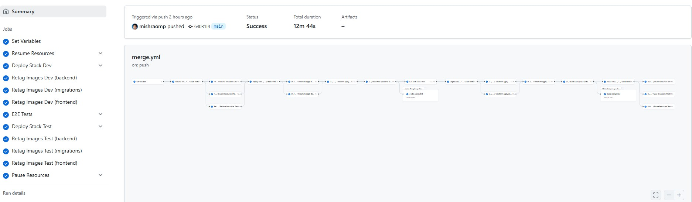
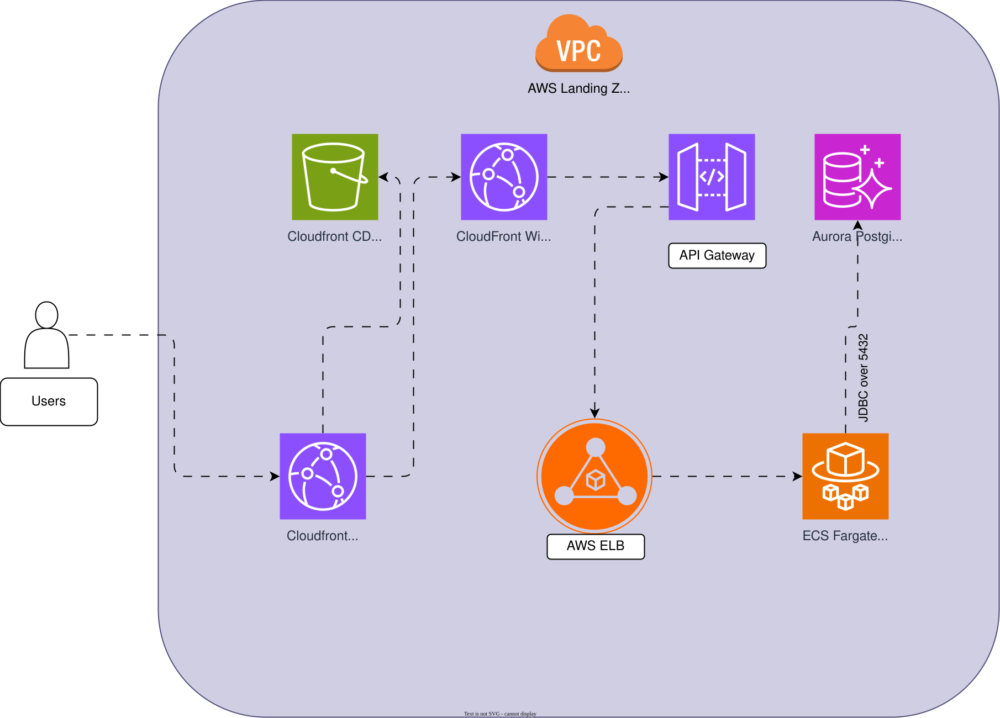

[](https://github.com/bcgov/quickstart-aws-sql/actions/workflows/merge.yml)
[](https://github.com/bcgov/quickstart-aws-sql/actions/workflows/pr-open.yml)
[](https://github.com/bcgov/quickstart-aws-sql/actions/workflows/pr-validate.yml)
[](https://github.com/bcgov/quickstart-aws-sql/actions/workflows/github-code-scanning/codeql)
[](https://github.com/bcgov/quickstart-aws-sql/actions/workflows/pause-resources.yml)
[](https://github.com/bcgov/quickstart-aws-sql/actions/workflows/resume-resources.yml)

# 🚀 AWS SQL Quickstart
### ⚡ Aurora Serverless v2 + ECS Fargate + CloudFront


> 🎯 **Ready-to-deploy containerized app stack for AWS!** Built by BC Government developers, for developers.

## 🌟 What's Inside?

This template gives you a complete, production-ready application stack with:

- 🗄️ **Aurora Serverless v2** PostgreSQL database with PostGIS extension
- 🐳 **ECS Fargate** with mixed FARGATE/FARGATE_SPOT capacity providers for cost optimization
- 🔄 **Flyway Migrations** automated through ECS tasks for database schema management
- 🚪 **API Gateway** with VPC link integration for secure backend access
- 🌐 **CloudFront** for frontend content delivery with WAF protection
- 🏗️ **NestJS** TypeScript backend API with Prisma ORM
- ⚛️ **React** with Vite for the frontend application
- 🏗️ **Terragrunt/Terraform** for infrastructure-as-code deployment
- 🔄 **GitHub Actions** for CI/CD pipeline automation
- 🔐 **AWS Secrets Manager** integration for secure credential management

## 📋 Prerequisites

Before you start, make sure you have:

- ✅ BCGOV AWS account with appropriate permissions
- ✅ AWS CLI installed and configured
- ✅ Docker/Podman installed (for local development)
- ✅ Node.js 22+ and npm installed
- ✅ Terraform CLI and Terragrunt


## 📁 Project Structure

```
/quickstart-aws-sql
├── 📄 CODE_OF_CONDUCT.md        # Project code of conduct
├── 📋 COMPLIANCE.yaml           # Compliance and regulatory information
├── 🤝 CONTRIBUTING.md           # Contribution guidelines
├── 🐳 docker-compose.yml        # Local development environment definition
├── 🔧 eslint.config.mjs         # ESLint configuration
├── 📖 GHA.md                    # GitHub Actions workflows documentation
├── 📜 LICENSE                   # Project license
├── 📦 package.json              # Monorepo configuration and dependencies
├── 📖 README.md                 # Project documentation
├── 🔄 renovate.json             # Renovate bot configuration
├── 🔒 SECURITY.md               # Security policy
├── 🔧 tsconfig.json             # TypeScript configuration
├── 🏗️ backend/                  # NestJS backend API code
│   ├── 🐳 Dockerfile            # Container definition for backend service
│   ├── 🔧 nest-cli.json         # NestJS CLI configuration
│   ├── 📦 package.json          # Backend dependencies
│   ├── 📝 prisma/               # Prisma ORM schema and migrations
│   │   └── schema.prisma        # Database schema definition
│   ├── 💻 src/                  # Source code (controllers, services, modules)
│   └── 🧪 test/                 # Backend test utilities
├── ⚛️ frontend/                 # Vite + React SPA
│   ├── 🌐 Caddyfile             # Caddy server config for frontend
│   ├── 🐳 Dockerfile            # Container definition for frontend service
│   ├── 📄 index.html            # Main HTML entry point
│   ├── 📦 package.json          # Frontend dependencies
│   ├── 🎭 e2e/                  # End-to-end tests using Playwright
│   ├── 📁 public/               # Static assets
│   └── 💻 src/                  # React source code
├── 🏗️ infra/                    # Terraform code for AWS infrastructure
│   ├── 📝 main.tf               # Infrastructure root module
│   └── 📁 modules/              # Infrastructure modules
│       ├── 🚪 api/              # API infrastructure (ECS, ALB, etc.)
│       ├── 🗄️ database/         # Database infrastructure (Aurora, etc.)
│       └── 🌐 frontend/         # Frontend infrastructure (CloudFront, etc.)
├── 🔄 migrations/               # Flyway migrations for database
│   ├── 🐳 Dockerfile            # Container for running migrations
│   └── 📝 sql/                  # SQL migration scripts
├── 🏗️ terragrunt/               # Terragrunt configuration for environments
│   ├── 🔧 terragrunt.hcl        # Root Terragrunt config
│   ├── 🧪 dev/                  # Dev environment config
│   ├── 🚀 prod/                 # Prod environment config
│   └── 🔬 test/                 # Test environment config
└── 🧪 tests/                    # Test suites beyond component-level
    ├── 🔗 integration/          # Integration tests across services
    └── ⚡ load/                 # Load testing scripts
```

## 🏗️ Key Components Explained

### 🔧 **Infrastructure (`terragrunt/` & `infra/`)**
- 🏗️ **Terragrunt**: Orchestrates infrastructure deployment across environments
- 📁 **Environment folders** (`dev`, `test`, `prod`): Environment-specific configurations
- 🏛️ **Terraform modules**: Reusable infrastructure components
  - 🚪 **API**: ECS Fargate backend (ALB, API Gateway, autoscaling, IAM, Secrets Manager)
  - 🌐 **Frontend**: CloudFront distribution and WAF
  - 🗄️ **Database**: Aurora Serverless v2 PostgreSQL with networking

### 💻 **Applications**
- 🏗️ **Backend (`backend/`)**: NestJS TypeScript API with Prisma ORM
- ⚛️ **Frontend (`frontend/`)**: React SPA built with Vite
- 🔄 **Migrations (`migrations/`)**: Flyway database schema management

### 🧪 **Testing & Quality**
- 🧪 **Unit Tests**: Built into each application
- 🎭 **E2E Tests**: Playwright for UI validation
- ⚡ **Load Tests**: Performance testing with k6
- 🔗 **Integration Tests**: Cross-service validation

## 🚀 Quick Start

### Option 1: 🐳 Docker Compose (Easiest!)

1. **Clone and navigate to the project:**
   ```bash
   git clone <repo-url>
   cd quickstart-aws-sql
   ```

2. **Start everything with one command:**
   ```bash
   docker-compose up --build
   ```

3. **Access your apps:**
   - 🌐 Frontend: http://localhost:3000
   - 🚪 Backend API: http://localhost:3001

4. **Stop when done:**
   ```bash
   docker-compose down
   ```

### Option 2: 💻 Local Development (Advanced)

**Prerequisites:**
- ☕ JDK 17+
- 📦 Node.js 22+
- 🗄️ PostgreSQL 17.4 with PostGIS
- 🔄 Flyway CLI

**Steps:**
1. **Start PostgreSQL** (as a service)

2. **Run database migrations:**
   ```bash
   java -jar flyway.jar \
     -url=jdbc:postgresql://$postgres_host:5432/$postgres_db \
     -user=$POSTGRES_USER \
     -password=$POSTGRES_PASSWORD \
     -baselineOnMigrate=true \
     -schemas=$FLYWAY_DEFAULT_SCHEMA \
     migrate
   ```

3. **Start the backend:**
   ```bash
   cd backend
   npm run start:dev  # or npm run start:debug
   ```

4. **Start the frontend:**
   ```bash
   cd frontend
   npm run dev
   ```

# 🚀 Deploying to AWS

## 🎯 Deployment Options

### Option 1: 🔄 GitHub Actions CI/CD (Recommended!)

The easiest way to deploy! Our pre-configured workflows handle everything:

- ✅ **Building and testing** changes on pull requests
- 🚀 **Auto-deployment** to AWS environments on merge
- 💰 **Resource management** (pause/resume for cost savings)
- 🧪 **Comprehensive testing** (unit, integration, load tests)
- 🔒 **Security scanning** with Trivy

**Quick Setup:**
1. 🍴 Fork or clone this repository
2. 🔐 Configure GitHub secrets (see below)
3. 📤 Push changes to trigger workflows

**Required GitHub Secrets:**
```
AWS_ROLE_TO_ASSUME     # IAM role ARN with deployment permissions
SONAR_TOKEN_BACKEND    # SonarCloud analysis for backend
SONAR_TOKEN_FRONTEND   # SonarCloud analysis for frontend
AWS_LICENSE_PLATE      # License plate from OCIO (without -dev/-test)
```

### Option 2: 🛠️ Manual Terraform Deployment

For direct control over your infrastructure:

1. **Configure AWS credentials locally**
2. **Navigate and deploy:**
   ```bash
   cd terraform/api/dev
   terragrunt init
   terragrunt plan
   terragrunt apply
   ```

📖 **Need help?** Check out our [detailed AWS deployment guide](https://github.com/bcgov/quickstart-aws-helpers/blob/main/AWS-DEPLOY.md).

# 🔄 CI/CD Workflows

Our GitHub Actions provide a complete DevOps pipeline with smart automation!

## 📋 Pull Request Flow


When you open a PR:
1. 🏗️ **Code builds** with concurrency control (no conflicts!)
2. 📊 **Infrastructure planning** with Terraform/Terragrunt
3. 🧪 **Comprehensive testing** in isolated environments
4. 🔒 **Security scans** with Trivy vulnerability detection
5. 📈 **Code quality analysis** with SonarCloud
6. 🎭 **Optional review environment** (manual trigger)

## 🚀 Merge & Deploy Flow


When code merges to main:
1. ⚡ **Auto-resume** AWS resources across environments
2. 🚀 **Deploy to dev** environment
3. 🏷️ **Tag containers** with 'dev'
4. 🧪 **Run E2E tests** against dev
5. ✅ **Deploy to test** (on success)
6. 🏷️ **Tag containers** with 'test'
7. 💤 **Auto-pause** resources to save costs

## 🔧 Workflow Categories

### 🚀 **Main Workflows**
- 📋 **PR Workflows**: `pr-open.yml`, `pr-validate.yml`, `pr-close.yml`
- 🚀 **Deployment**: `merge.yml`, `release.yml`

### 🔄 **Composite Workflows**
- 🏗️ **Building**: `.builds.yml`
- 🧪 **Testing**: `.tests.yml`, `.e2e.yml`, `.load-test.yml`
- 🚀 **Deployment**: `.deploy_stack.yml`, `.destroy_stack.yml`

### 💰 **Cost Optimization**
- ⏸️ **Pause Resources**: `pause-resources.yml` (scheduled/manual/auto)
- ▶️ **Resume Resources**: `resume-resources.yml` (before deployments)
- 🧹 **Cleanup**: `prune-env.yml`

📖 **Want more details?** Check out our [complete GitHub Actions guide](./GHA.md)!

## 🏛️ Architecture Overview


### 🏗️ Infrastructure Highlights

#### 🐳 **ECS Fargate Configuration**
- 💰 **Cost-Optimized**: 20% FARGATE (reliable) + 80% FARGATE_SPOT (cheap!)
- 📈 **Smart Auto-Scaling**: 
  - Scales UP aggressively (+2 instances when busy)
  - Scales DOWN conservatively (-1 instance when idle)
- 🔄 **Migration Tasks**: Flyway runs before app deployment
- 🔐 **Secure Secrets**: Database credentials from AWS Secrets Manager

#### 🚪 **API Gateway**
- 🌐 HTTP API Gateway with VPC Link integration
- 🔄 Routes all traffic to internal Application Load Balancer
- 🛡️ Supports ANY method with proxy path integration

#### 🗄️ **Database Integration**
- 🔌 Auto-connects to Aurora PostgreSQL
- 🔐 Master credentials from Secrets Manager
- 🔄 Schema migrations via Flyway ECS tasks
- 📖 Read/write splitting with separate endpoints

# 🎨 Customizing Your Project

Ready to make this template your own? Here's your roadmap! 🗺️

## 1. 🚀 **Repository Setup**
- 🍴 Clone this repository
- 📝 Update project names in `package.json` files
- 🔐 Set up required GitHub secrets

## 2. 🏗️ **Infrastructure Customization**
- 🔧 **Terraform/Infrastructure**: Modify `terraform` and `infrastructure` directories
- ⚙️ **Environment Variables**: Update environment-specific variables
- 📊 **ECS Task Definitions** (`infrastructure/api/ecs.tf`):
  - 💾 Customize container resources (CPU/memory)
  - 📈 Modify auto-scaling thresholds (`infrastructure/api/autoscaling.tf`)
  - 💰 Update capacity provider strategy (cost vs. reliability)
- 🗄️ **Database**: Configure connection parameters and schema
- 🚪 **API Gateway**: Customize settings in `infrastructure/api/api-gateway.tf`

## 3. 💻 **Application Customization**
- 🏗️ **Backend**: Customize NestJS in the `backend/` directory
- ⚛️ **Frontend**: Adapt React app in the `frontend/` directory  
- 🔄 **Database**: Update schema and migrations in `migrations/sql/`

## 4. 🔄 **CI/CD Pipeline Adjustments**
- 🔧 **Workflows**: Modify GitHub workflows in `.github/workflows/`
- 🚀 **Deployment**: Update configuration for your AWS account
- 💰 **Resource Management**: Configure pause/resume schedules
  - ⏰ Adjust cron schedules for your working hours
  - 🛡️ Set up environment-specific resource management
  - 🔒 Customize protection rules for production

## 5. 🧪 **Testing Setup**
- 🧪 **Backend Tests**: Adapt Vitest tests in `backend/src/`
- ⚛️ **Frontend Tests**: Update tests in `frontend/src/__tests__/`
- 🎭 **E2E Tests**: Modify Playwright tests in `frontend/e2e/`
- ⚡ **Load Tests**: Customize k6 tests in `tests/load/`
- 📈 **SonarCloud**: Update project keys for code quality analysis
- 🔄 **GitHub Workflows**: Adjust test runners for your environments

# 🤝 Contributing

We ❤️ contributions! Want to help make this template even better? 

👉 **Check out our [CONTRIBUTING.md](CONTRIBUTING.md)** for:
- 📋 Contribution guidelines
- 🔄 Development workflow
- 🧪 Testing requirements
- 📝 Code standards


